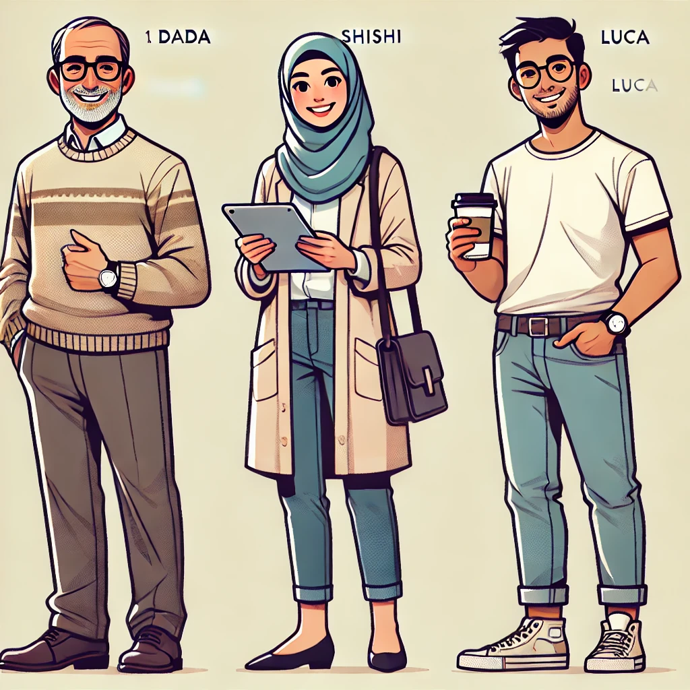

# Conception et Réalisation de Tâches avec les TIC
**Master 1 DILIPEM - 2018/2019**

# GRILLE ANALYSE D’UNE TÂCHE

## Tâche finale ?
- est-elle annoncée ?
  - Oui. La tâche finale consiste à préparer et envoyer une candidature complète, avec un CV, une lettre de motivation, et une simulation d’entretien.
- de quelle manière est-elle annoncée ? Par une mise en situation ?
  - Oui. La séquence présente progressivement les outils et étapes de la recherche d’emploi, jusqu’à l'envoi d'une candidature et l’entretien.
- individuelle ? Collective ?
  - Individuelle pour la majorité des exercices pratiques, mais avec des moments collectifs pour les discussions et les simulations d’entretien.

## Tâches qui s’enchaînent dans un projet ?
  - Oui. Les tâches s’enchaînent logiquement depuis l’initiation informatique jusqu’à la simulation de candidature.
**Suite des tâches scénarisées ?**
  - Oui. La séquence forme une progression scénarisée où chaque étape prépare les apprenants à la suivante.

## Thème culturel et/ou problématique explicité.s ?
  - Thème : Recherche d’emploi en France et introduction aux pratiques professionnelles françaises (types de contrats, attentes des employeurs).
  - Problématique : Accès et insertion dans le marché du travail pour des apprenants migrants.

## Modalités pédagogiques du dispositif de formation intégrant la tâche ?
- distanciel
- hybride (mix présence et distance)
- présentiel
  - Présentiel et/ou hybride. La séquence peut se dérouler en présentiel pour les activités pratiques et les simulations, ou en distanciel pour certains modules (ex : initiation informatique).

## Sous-tâches ou "tâches-intermédiaires" annoncées ?
  - Oui. Les sous-tâches sont annoncées et sont des étapes nécessaires, comme l’utilisation de l’ordinateur, la création de documents et l’initiation au marché du travail.
- répartition équilibrée des tâches?
  - Oui. La répartition est équilibrée avec une progression des compétences numériques aux compétences professionnelles.
- servent-elles directement à la réalisation de la tâche ? Oui/Non, Comment ?
  - Oui. Les sous-tâches (compétences numériques, vocabulaire, rédaction de CV et lettre) sont directement utiles pour la tâche finale.

## Compétence(s) générales et/ou communicatives visées ?
  - Compétences générales : Maîtrise des outils numériques de base.
  - Compétences communicatives : Capacités de rédaction et présentation pour une candidature professionnelle en France.
- diversité des compétences ?
  - Oui. La séquence couvre des compétences numériques, linguistiques et professionnelles (comme la rédaction de CV).

## Activités langagières selon le CECRL (réception, production, interaction, médiation)
  - Réception, Production et Interaction. La réception est abordée via la compréhension des consignes et du vocabulaire d’emploi, la production à travers la rédaction de documents, et l’interaction dans les simulations d’entretien.
- il y-a-t-il une prédominance d’une activité par rapport aux autres?
  - Production et Interaction sont prédominantes, notamment pour la rédaction de documents et la simulation d’entretien.
- avec quelle articulation ?

## Quel type d’activités ? sont-elles variées ? 
- Oui / Non /quels avantages / inconvénients ?
  - Oui. Activités variées telles que l’apprentissage des outils informatiques, la rédaction de documents, le jeu de rôle et les discussions.
  - Avantages : Favorise l’engagement, apprentissage complet et contextualisé.

## Quel type de ressources ?
- authentique
- authentique manipulé
- fabriqué
- didactisé
  - Authentiques manipulées et fabriquées. Par exemple, des modèles de CV et lettres de motivation adaptés aux apprenants.

## Outils (ENT, logiciels, Internet) – quelles fonctionnalités ?
  - ENT (Moodle ou autre) pour le suivi, Internet pour les ressources de recherche d’emploi, traitement de texte (Word, Google Docs), et outils de communication numérique (e-mail).

## Aides (linguistiques, méthodologiques, métacognitives (apprendre à apprendre))
  - **Linguistiques** : exercices de vocabulaire.
  - **Méthodologiques** : fiches de réflexion et modèles de documents.
  - **Métacognitives** : forums de débriefing et bilan collectif.

## Évaluation (formative- non notée/ sommative – finale / autoevaluation)
  - Formative et autoévaluation. Les forums permettent des retours réflexifs, et la simulation de candidature sert d'évaluation finale.

## Ergonomie de la plateforme (navigation intuitive,…)
  - Navigation intuitive avec des modules distincts et une progression claire.

## Appétence pour l’apprenant
  - Appétence forte. La séquence répond à un besoin pratique, ce qui motive les apprenants.

## Tâche vraisemblable ? Réalisable grâce aux "sous-tâches"/"tâches-intermédiaires" ?
(alignement pédagogique respecté ?)
  - Oui. La progression permet aux apprenants de se préparer pour la simulation finale grâce aux compétences acquises dans les sous-tâches.

## Durée de réalisation en temps apprenant (une séance, une séquence,..) :
  - Séquence de plusieurs séances pour chaque module, avec une simulation finale.

## Autres éléments :
  - Pistes de prolongement : Prévoir des supports pour aider les apprenants après la séquence, comme une fiche récapitulative des démarches administratives en cas d'embauche.

# La séquence
| Pour concrétiser cette séquence, le mieux serait de la structurer avec une narration immersive, comme une mini-histoire ou un fil conducteur motivant qui donnera une cohérence et un aspect dynamique à chaque étape. L’objectif est de donner aux apprenants le sentiment qu’ils progressent vers une finalité claire tout en créant un environnement de formation proche de la réalité. Voici quelques idées pour unir les modules et les rendre interactifs : |  |

## 1. Choix d’un fil rouge : l’informatique comme clé d’insertion professionnelle
- **Contexte** : introduire la séquence avec un scénario où Dada, Shishi et Luca accueillent les apprenants en tant que "guides" ou "coachs" pour une mission d’insertion professionnelle.
- **Mise en situation initiale** : les apprenants sont invités à rejoindre une formation avec ces trois personnages, chacun ayant une spécialité : Dada pour les compétences de base (utilisation de l’ordinateur), Shishi pour la communication numérique, et Luca pour les outils bureautiques et la préparation à la candidature.
- **Objectif global** : chaque module représente une compétence-clé dans une mission de recherche d’emploi, et leur objectif est de suivre chaque étape pour accéder à un poste fictif final (ou réel, si les apprenants cherchent activement un emploi).

## 2. Scénarisation de l’introduction et des transitions
- **Introduction** : lancer la séquence avec une vidéo d’accueil où Dada, Shishi et Luca se présentent et expliquent l’objectif du programme. Cela ancre immédiatement les apprenants dans le processus et clarifie les objectifs.
- **Transitions immersives** : créer de courtes introductions vidéo ou audio pour chaque module où le personnage correspondant explique son module et encourage les apprenants. Cela ajoute un aspect humain et engageant.
- **Checkpoint** : à la fin de chaque module, intégrer un petit quiz ou un défi pour débloquer le module suivant. Cela encourage la progression et permet de vérifier la compréhension des apprenants.

## 3. Gamification et suivi de progression
- **Score de progression** : associer un score ou un badge pour chaque module complété, avec une page de progression visuelle. À la fin, tous les badges débloqués pourraient permettre aux apprenants de « valider » leur formation ou de gagner un certificat de participation.
- **Challenge final** : après les modules individuels, organiser un « grand défi » où les apprenants utilisent tout ce qu’ils ont appris pour rédiger leur candidature complète et participer à une simulation d’entretien. Dada, Shishi et Luca peuvent introduire cette étape en donnant des conseils personnalisés.

## 4. Intégration des outils numériques et des ressources
- **Forum ou espace d’échange** : créer un forum où Dada, Shishi, et Luca « interagissent » (par l’enseignant ou des assistants) pour répondre aux questions, donner des conseils ou encourager les apprenants. Les forums permettent également aux apprenants de partager leurs expériences et d’enrichir le contenu.
- **Supports multimédias et guides pratiques** : intégrer des tutoriels vidéo ou des captures d’écran pour chaque activité technique (ex. allumer l’ordinateur, créer un compte mail) et inclure des guides téléchargeables pour que les apprenants puissent les consulter en dehors du cours.

## 5. Structure d'ouverture et de clôture de la séquence
- **Clôture** : terminer avec un récapitulatif et un bilan des compétences acquises. Ce moment pourrait inclure une invitation à un forum de partage des candidatures ou des témoignages sur la progression. Pour ceux qui le souhaitent, Dada, Shishi et Luca pourraient donner des "conseils finaux" pour le marché du travail.

En structurant la séquence avec une narration immersive et une progression gamifiée, on crée un parcours engageant et cohérent qui stimule la motivation et l’apprentissage des apprenants.

_Ressource construite à partir d’une grille d’Elena Tea 2017-2018_
